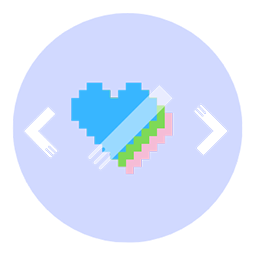

    
     
    <b style="font-size: 50px">Code Day: 24 hours of fun</b>

---

- 周末放假觉得无聊？不愿意一个人打打游戏看看剧度过自己的这一周？

- 想要提升自己的技能、尝试新的东西、参与一些社交活动？

来试试Code Day吧！**Code Day** 是这样一场活动：有着独特技能的学生们聚在一起，在Code Day刚开始时分享自己的Idea和Skill或者倾听他人的发言......无论如何，你将在有限的时间内与他人合作实现一款新的应用、游戏等等......

## 活动安排

<table>
    <tr>
        <th colspan="2">第一天</th>
        <th colspan="2">第二天</th>
    </tr>
    <tr>
        <td>09:00am</td>
        <td>活动开始，等待人员到齐及设备启动</td>
        <td>09:00am</td>
        <td>次日活动开始</td>
    </tr>
    <tr>
        <td>09:10am</td>
        <td>分享讨论夜的心得、技术分享展示等</td>
        <td>09:10am</td>
        <td>组内分享昨日开发心得，确认今日方向</td>
    </tr>
    <tr>
        <td>10:30am</td>
        <td>准备分组，此后可以自寻场地进行Team Work</td>
        <td>09:30am</td>
        <td>继续Coding</td>
    </tr>
    <tr>
        <td>11:00am</td>
        <td>开始Codeing：基本环境</td>
        <td>11:00am</td>
        <td>Demo成型，进行一次小的展示和分享</td>
    </tr>
    <tr>
        <td>12:00am</td>
        <td>用午餐及午休</td>
        <td>12:00am</td>
        <td>用午餐及午休</td>
    </tr>
    <tr>
        <td>14:00am</td>
        <td>午休结束，开始半小时的午后讨论会及进行新的开发</td>
        <td>14:00am</td>
        <td>午休结束，开始半小时的午后讨论会及进行新的开发</td>
    </tr>
    <tr>
        <td>09:00pm</td>
        <td>第一日活动结束，做组内总结和准备晚间休息</td>
        <td>07:00pm</td>
        <td>活动交流会</td>
    </tr>
    <tr>
        <td>09:30pm</td>
        <td>Clean up & Go Home</td>
        <td>09:00pm</td>
        <td>所有项目停止，活动结束</td>
    </tr>
</table>

**讨论夜** 在活动正式开始的前一日晚间时分开展，主要的工作为：

1. 交代本次活动的主要方向，确认时间表。
2. 选出本次Coding的主题：每个人写出一个关键词，随机抽取。
3. 讨论各自关于这个主题的想法、交换Idea。
4. 准备自己所期望在本次限时编程活动中所需要的材料：如想学习到的新技术、想与别人分享的技术和开发工具等；这些内容将在第二天进行分享和讨论。

整个活动除去`讨论夜`和`夜晚休息时间`差不多正好**24小时**，在这24小时内你必须和队友一同进退，合作商量问题的解决方法。

### 你所需要准备的东西

1. 不鸽。
2. 精神饱满的24小时。
3. 你曾经心心念念但一直没敢去尝试的新事物：软件、开发工具、开发语言、产品点子......
4. 互帮互助。

你**不用担心自身的编程水平**问题：比如不会JS、不会Java和不知道怎么使用Git等，`Code Day`就是要在有限的时间内通过紧张又刺激的团队合作，来分享各自的知识和逼着你快速进步。

### 你将会得到的

在活动结束时，你们将能够：

- 深度参与团队合作，为项目创建脚手架、在线搜索技术问题的答案以及编写完整且有效的应用程序或游戏。

- 尝试之前所不敢尝试的东西。
- 一个可供展示的项目，你可以将这个项目挂在你的Github之上。
- 好基友、好丽友。

### 随手做了个海报

    

---

### 我的心得

我参加过一次隔壁社团组织的Code Day，一天时间Force我学会了之前一直没敢尝试的东西：`Kotlin`和一些相关的工具，让我体会到合作编程的快感。因此非常上瘾，国庆闲着无聊想着我们不如也来一次。

由于不同人有不同的编程习惯和编程工具，在合作的过程中你会发现原来世界上还有这么多神奇的软件，可以提高我们的编程效率。

在合作的同时也会发现代码质量的重要性，潜移默化中影响我们的编程风格。

更重要的是，一个人编程是非常孤独的；大家研究生生活除了几个舍友就是实验室的一些人，社交圈子本来就非常小，凭借这个活动或许能够多认识一些朋友，那自然也是非常不错的。